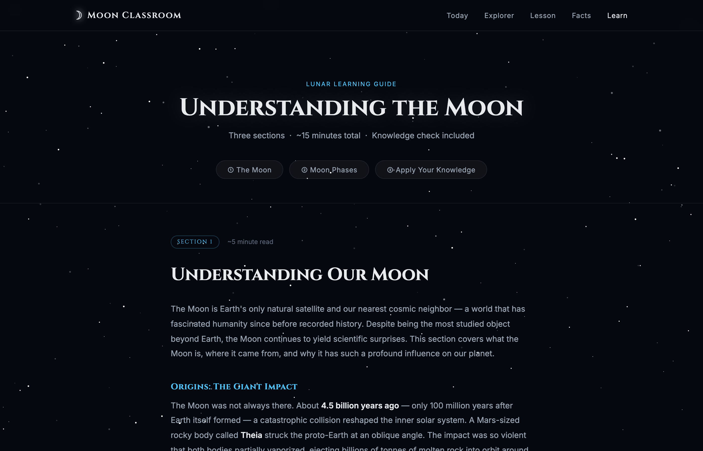

# Moon Classroom




An interactive lunar education app built with Flask. Learn about moon phases, illumination data, visibility, science, and cultural significance — updated daily based on real lunar calculations.

## Features

- **Tonight's Moon** — current phase, illumination percentage, moon age, and days until the next full moon
- **Date Explorer** — pick any date to look up its moon phase and lesson
- **Phase Lessons** — for each phase: what's happening, visibility, the science, and cultural notes
- **Lunar Cycle Diagram** — visual overview of all 8 phases with the current one highlighted
- **Moon Facts** — curated facts about Earth's only natural satellite
- **Learn** — a long-form guided article covering lunar science (origins, physical profile, tidal locking) and moon phases, with live tonight's moon data embedded inline and a knowledge-check quiz at the end

## Getting Started

**Prerequisites:**
- Python 3.9 or later (`python3 --version` to check)
- pip (bundled with Python 3.9+)
- No database or external services required

```bash
# Install dependencies
pip install -r requirements.txt

# Run the app
python app.py
```

Then open [http://localhost:5050](http://localhost:5050) in your browser.

To enable debug mode (auto-reload on file changes):

```bash
FLASK_DEBUG=True python app.py
```

## API

The app exposes a JSON endpoint for moon phase data.

```
GET /api/moon?date=YYYY-MM-DD
```

The `date` parameter is optional and defaults to today.

**Example request:**

```bash
curl "http://localhost:5050/api/moon?date=2025-07-04"
```

**Example response:**

```json
{
  "date": "2025-07-04",
  "phase": 0.2871,
  "phase_name": "First Quarter",
  "emoji": "🌓",
  "illumination": 72.5,
  "age": 8.5,
  "days_to_full": 6,
  "upcoming_phases": [
    { "name": "Full Moon",     "emoji": "🌕", "date": "July 10, 2025", "iso": "2025-07-10", "time_utc": "20:37 UTC" },
    { "name": "Last Quarter",  "emoji": "🌗", "date": "July 17, 2025", "iso": "2025-07-17", "time_utc": "11:38 UTC" },
    { "name": "New Moon",      "emoji": "🌑", "date": "July 24, 2025", "iso": "2025-07-24", "time_utc": "19:11 UTC" },
    { "name": "First Quarter", "emoji": "🌓", "date": "August 1, 2025","iso": "2025-08-01", "time_utc": "02:41 UTC" }
  ],
  "lesson": {
    "description": "The Moon has completed one quarter of its orbit. Exactly half of the visible face is lit.",
    "visibility": "High in the sky at sunset, sets around midnight.",
    "science": "The terminator — the line between light and dark — is straight, and lunar craters are most visible here.",
    "cultural_note": "Called 'first quarter' because the Moon has traveled one quarter of its orbit."
  }
}
```

**Error response** (invalid date format):

```json
{ "error": "Invalid date format. Use YYYY-MM-DD." }
```

HTTP status `400`.

## Moon Phase Skill

The app is built around a [Claude Code skill](.claude/skills/moon-phase/) that encapsulates all lunar calculation logic. The skill has two parts:

**`SKILL.md`** — instructions that tell Claude how to act as a lunar guide: when to invoke the calculator, how to interpret its output, what topics to cover (phases, tides, gardening, photography timing, folklore), and how to format responses. It also defines the phase→emoji mapping and guards against common mistakes like inferring a phase name from illumination percentage alone.

**`scripts/moon_calculator.py`** — a self-contained Python script that does the actual astronomy. It implements the Julian Date (JD) conversion and phase fraction formula from Jean Meeus' *Astronomical Algorithms* (2nd ed.), with no external dependencies. It accepts an optional `YYYY-MM-DD` argument (defaults to today) and prints a JSON object:

```bash
python3 scripts/moon_calculator.py              # today
python3 scripts/moon_calculator.py 2025-07-04   # specific date
```

```json
{
  "query_date": "July 4, 2025",
  "query_date_iso": "2025-07-04",
  "phase_name": "First Quarter",
  "phase_emoji": "🌓",
  "phase_fraction": 0.2871,
  "illumination_percent": 72.5,
  "direction": "waxing",
  "age_days": 8.5,
  "days_to_next_new_moon": 21.1,
  "synodic_month_days": 29.530588853,
  "upcoming_phases": [
    { "name": "Full Moon", "emoji": "🌕", "date": "July 10, 2025", "iso": "2025-07-10", "time_utc": "20:37 UTC" },
    ...
  ]
}
```

### How the app uses the skill

The Flask app invokes the calculator as a subprocess via `get_moon_data()` in [app.py](app.py), which runs `moon_calculator.py` and parses its JSON output. This happens in three places:

| Route | Usage |
|---|---|
| `GET /` | Fetches today's data to power the Tonight's Moon card, Lunar Cycle Diagram, and Phase Lesson on the homepage |
| `GET /learn` | Fetches today's data to embed the live "Tonight" callout card inside the Moon Phases section of the Learn article |
| `GET /api/moon` | Fetches data for any requested date and returns the raw JSON to the Date Explorer (used by the frontend to update the phase display and lesson without a page reload) |

## Documentation

- [CLAUDE.md](CLAUDE.md) — Claude Code guidance: repo layout, conventions, running the app
- [llms.txt](llms.txt) — AI-optimized project summary and API reference
- [Moon Phase Calculation — Developer Reference](docs/moon-phase.md) — full reference for the skill architecture, calculator output schema, and field mapping

## Stack

- [Flask](https://flask.palletsprojects.com/) 3.1.3 — web framework
- Vanilla JavaScript — date explorer and moon visual
- CSS custom properties + animations — star field and moon rendering
- Pure Python math — lunar phase calculations (no external astronomy libraries)
