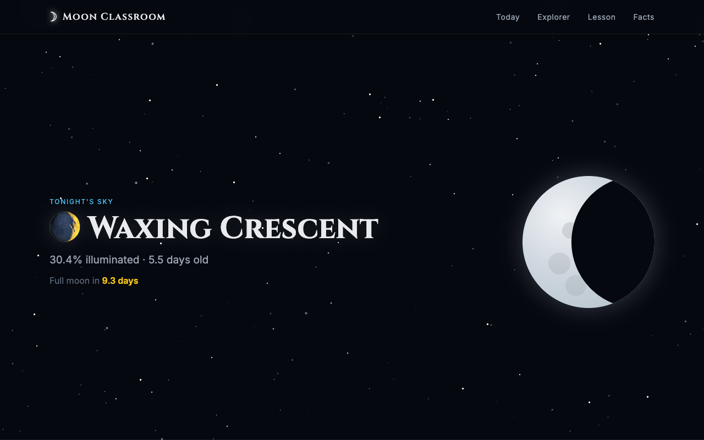

# Moon Classroom



An interactive lunar education app built with Flask. Learn about moon phases, illumination data, visibility, science, and cultural significance — updated daily based on real lunar calculations.

## Features

- **Tonight's Moon** — current phase, illumination percentage, moon age, and days until the next full moon
- **Date Explorer** — pick any date to look up its moon phase and lesson
- **Phase Lessons** — for each phase: what's happening, visibility, the science, and cultural notes
- **Lunar Cycle Diagram** — visual overview of all 8 phases with the current one highlighted
- **Moon Facts** — curated facts about Earth's only natural satellite

## Getting Started

**Requirements:** Python 3.9+

```bash
# Install dependencies
pip install -r requirements.txt

# Run the app
python app.py
```

Then open [http://localhost:5050](http://localhost:5050) in your browser.

To enable debug mode:

```bash
FLASK_DEBUG=True python app.py
```

## API

The app exposes a simple JSON endpoint:

```
GET /api/moon?date=YYYY-MM-DD
```

**Example:**

```bash
curl http://localhost:5050/api/moon?date=2025-07-04
```

**Response:**

```json
{
  "phase": 0.2871,
  "phase_name": "First Quarter",
  "emoji": "🌓",
  "illumination": 72.5,
  "age": 8.5,
  "days_to_full": 6.4,
  "date": "2025-07-04",
  "lesson": {
    "description": "...",
    "visibility": "...",
    "science": "...",
    "cultural_note": "..."
  }
}
```

## Documentation

- [Moon Phase Calculation — Developer Reference](docs/moon-phase.md)

## Stack

- [Flask](https://flask.palletsprojects.com/) — web framework
- Vanilla JavaScript — date explorer and moon visual
- CSS custom properties + animations — star field and moon rendering
- Pure Python math — lunar phase calculations (no external astronomy libraries)
